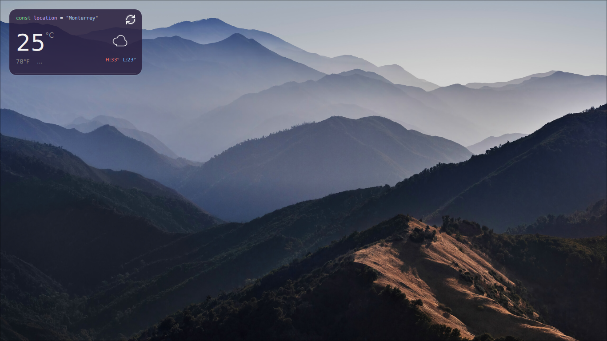

# widget de clima glassmorphism

widget de clima para [quickshell](https://quickshell.outfoxxed.me/) con estilo glassmorphism, construido en qml.



## caracteristicas

- fondo oscuro morado/azul con efecto glassmorphism
- header estilo codigo: `const location = "Monterrey"`
- temperatura actual en grados celsius con conversion a fahrenheit
- icono svg flat/line-art segun el tipo de clima
- temperatura maxima (h) y minima (l) del dia
- pronostico por hora con 5 columnas (ahora + 4 horas)
- boton de recarga con animacion de giro
- api de [open-meteo](https://open-meteo.com/) (gratuita, sin api key)

## instalacion

### requisitos

- [quickshell](https://quickshell.outfoxxed.me/)
- compositor wayland (hyprland, sway, etc.)

### pasos

1. clona o copia los archivos en la configuracion de quickshell:

```bash
cp -r shell.qml apiClima.js svgs/ imgs/ ~/.config/quickshell/
```

2. reinicia quickshell:

```bash
pkill -f quickshell && quickshell -d
```

## estructura

```
.
├── shell.qml        # archivo principal con la interfaz del widget
├── apiClima.js      # funciones para obtener y procesar datos del clima
├── svgs/            # iconos svg flat/line-art para cada tipo de clima
│   ├── sunny.svg
│   ├── cloudy.svg
│   ├── rain.svg
│   ├── snow.svg
│   ├── storm.svg
│   ├── fog.svg
│   └── reload.svg
└── imgs/
    └── muestra.png  # imagen de ejemplo del widget
```

## personalizacion

### cambiar la ubicacion

edita las coordenadas en `apiClima.js`:

```javascript
var lat = 25.6866    // latitud
var lon = -100.3161  // longitud
```

puedes buscar tus coordenadas en [latlong.net](https://www.latlong.net/).

### cambiar el nombre de la ciudad

edita el texto en `shell.qml`:

```qml
text: '<span style="color:#7ee787">const</span> <span style="color:#d2a8ff">location</span> <span style="color:#f0f0f0">=</span> <span style="color:#a5d6ff">"tu ciudad"</span>'
```

### efecto blur (hyprland)

para que se vea el blur del escritorio detras del widget, agrega estas lineas en tu config de hyprland:

```
windowrulev2 = opacity 0.0 0.0 0, namespace:^(clima)$
layerRule = namespace:clima, blur, 1
```

## api

este widget usa la api de [open-meteo](https://open-meteo.com/) que es gratuita y no requiere api key.

datos obtenidos:
- temperatura actual
- codigo del clima (wmo)
- pronostico por hora
- temperatura maxima y minima del dia

## licencia

MIT
